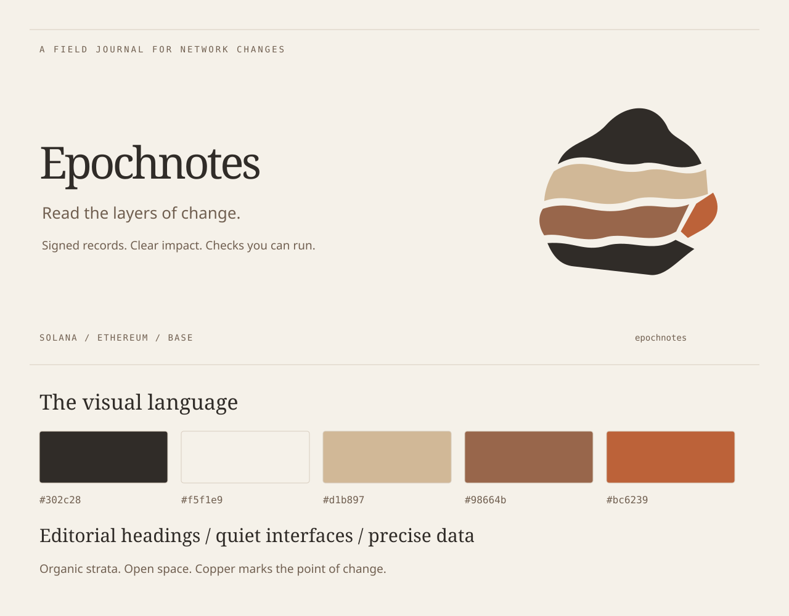

# Epochnotes visual identity

A field journal for network changes. Geological strata represent epochs: each layer preserves a record, and the copper seam marks a point of change.

## Palette

| Token      | Color     | Role                                     |
| ---------- | --------- | ---------------------------------------- |
| Charcoal   | `#302c28` | Text, mark, primary action               |
| Limestone  | `#f5f1e9` | Page and artwork background              |
| Sandstone  | `#d1b897` | Historical layers and structural accents |
| Clay       | `#98664b` | Secondary layers                         |
| Copper     | `#bc6239` | The change seam, decorative emphasis     |
| Ink copper | `#934521` | Accessible links on limestone            |

Dark pages use warm charcoal `#211f1c`, pale text `#f0e9df` and light copper `#eda579` for links. The mark's charcoal strata become mineral gray `#a89c8d` to retain their silhouette. State colors remain semantic and always appear with a text label.

## Typography

Editorial headings and the wordmark use Georgia, with Times New Roman and serif fallbacks. Body text uses the operating system's sans-serif. Commands, dates, counters and field labels use the system monospace. No font downloads are required.

Large headlines have tight spacing and short lines. Body text uses a 1.65 line height and a maximum reading width of 72 characters. Small labels use modest letter spacing; never set paragraphs in uppercase.

## Mark and composition

Use `mark.svg` as the source mark. Keep one quarter of its width clear around it. Use it at 32 px or larger; for smaller favicons retain the silhouette and omit interior hairlines. Preserve the strata's proportions, irregular boundaries and copper exposure. Do not stretch, rotate, add shadows or enclose it in a shield.

Use warm backgrounds, ample space, fine rules, restrained rectangular panels and mineral-colored edge accents. Layer graphics are for covers, section boundaries and major moments; keep tables and command output quiet and readable.

## Assets and publishing

- `mark.svg`: scalable standalone mark.
- `icon.png`: transparent 180 × 180 icon.
- `github-banner.svg`: README cover, 1280 × 640.
- `social.png`: 1280 × 640 social preview; upload it in GitHub repository Settings → General → Social preview.
- `social.svg`: editable source for the social preview.
- `style-board.svg`: palette and composition reference.

The page uses the same mark geometry inline, embeds its SVG favicon, and has no external scripts or fonts. Regenerate SVGs with `npm run brand`; regenerate the page with `npm run site`. After changing the artwork, export `social.svg` to a 1280 × 640 PNG and `mark.svg` to a transparent 180 × 180 PNG. GitHub repository controls use GitHub's own theme; the identity applies to the README and repository social preview.
